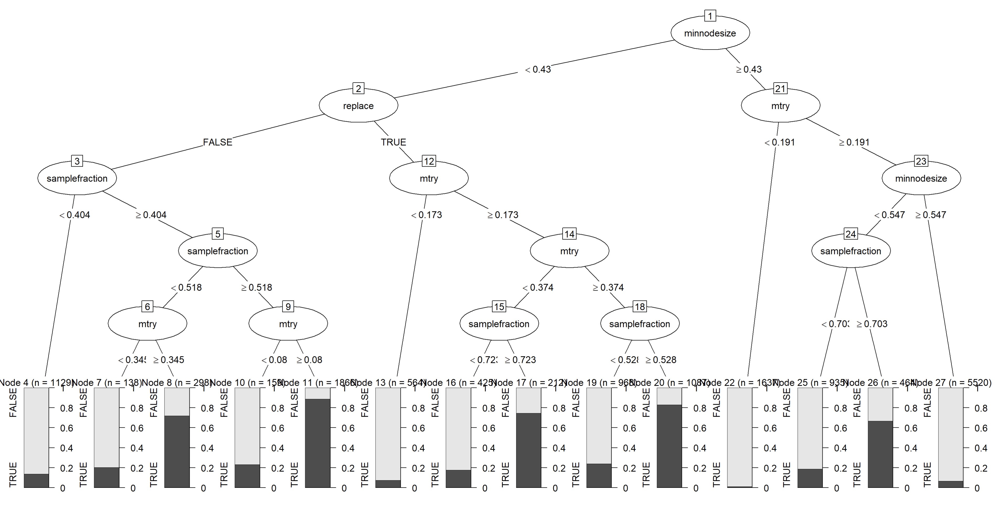
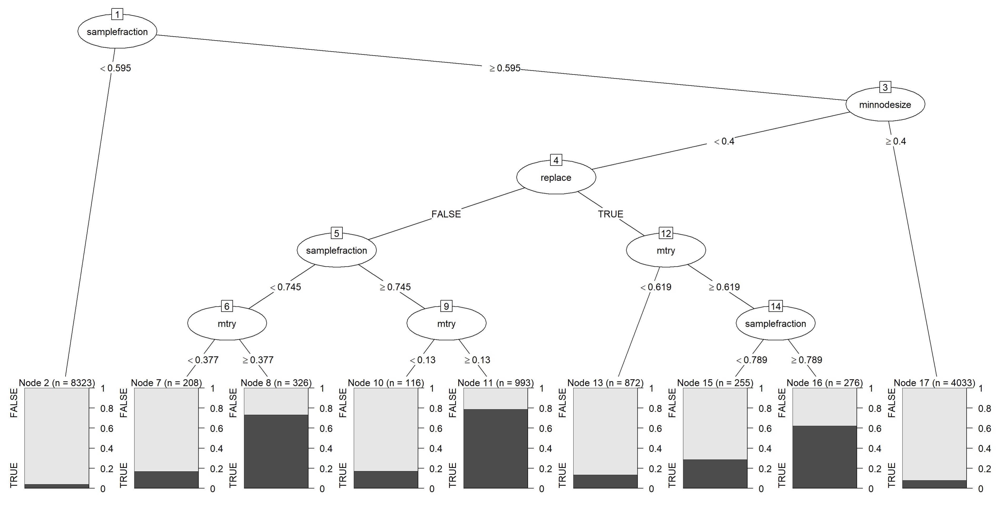
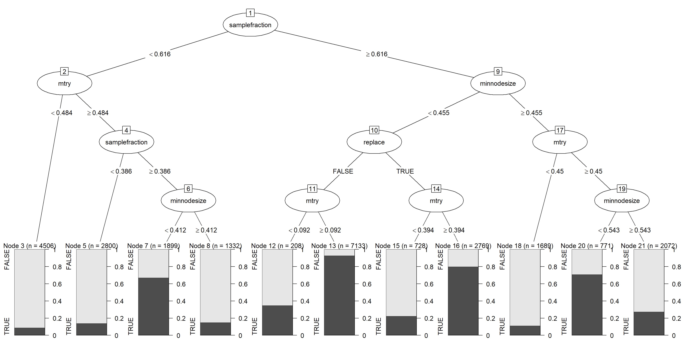
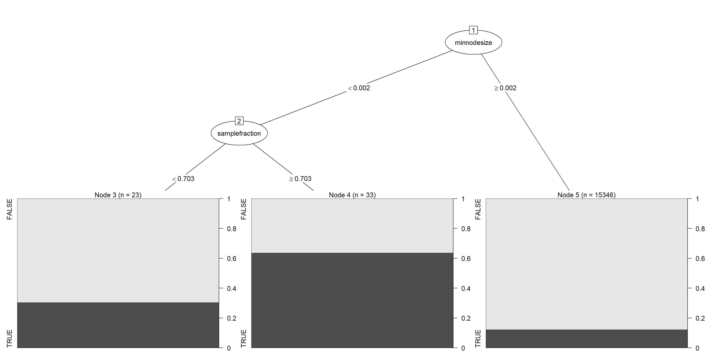
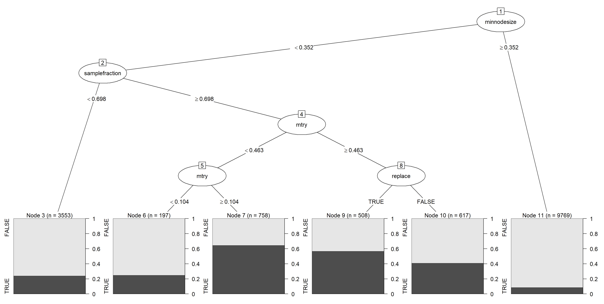

# HydroHyperOpt
To download this package, run the following code:
1. Install the devtools package with install.package("devtools")
2. Load the devtools package with library(devtools)
3. Install this package with install_github("HydroML/HydroHyperOpt")
4. Load the HydroHyperOpt package with library(HydroHyperOpt)

Our new optimal defaults mentioned in our paper were carfully devised trying to find a large area in the space of hyperparameter sets that were consistently better than the previous optimal defaults. We used the evtree package in R to run this classification, though this sometimes failed, perhaps due to neeing linear instead of constant cuts in space. In these cases we performed manual classification.

This figure shows the optimized evtree after trying to partition the hyperparameter space based on whether different hyperparameter sets did better or worse than the original set of random forest default hyperparameters (in terms of KGE). 

Similar to the above plot, this figure shows the optimized evtree after trying to partition the hyperparameter space based on whether different hyperparameter sets did better or worse than the optimal defaults proposed by Probst for random forests (in terms of KGE). 

A very small portion of the observations show better results compared to the optimal defaults, therefore in this run of evtree, we weighted each observation by the inverse of its class frequency. Details as above: random forests, KGE, class= TRUE (if better than optimal default) or FALSE (if worse than optimal default).

Similar to the above plot, this figure shows the optimized evtree after trying to partition the hyperparameter space based on whether different hyperparameter sets did better or worse than the optimal defaults proposed by Probst for random forests (in terms of NSE). 

This figure shows the optimized evtree after trying to partition the hyperparameter space based on whether different hyperparameter sets did better or worse than the original set of random forest default hyperparameters (in terms of NSE). 

# How to cite
Bilolikar, D. K., More, A., Gong, A., & Janssen, J. (2023). How to out-perform default random forest regression: choosing hyperparameters for applications in large-sample hydrology. arXiv preprint arXiv:2305.07136.
